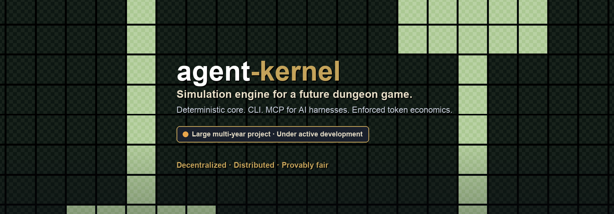
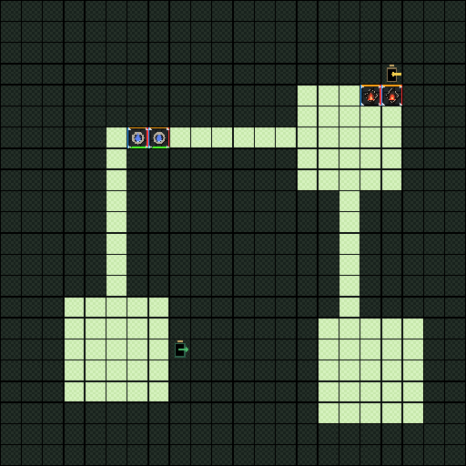

<p align="center">
  
</p>

<p align="center">
  
</p>

<p align="center">
  
  &nbsp;
  
  &nbsp;
  
  &nbsp;
  
  &nbsp;
  
  &nbsp;
  
  &nbsp;
  
  &nbsp;
  
  &nbsp;
  
  &nbsp;
  
</p>

<p align="center">
  <a href="#the-engine"><b>The engine</b></a>
  &nbsp;·&nbsp;
  <a href="#surfaces">Surfaces</a>
  &nbsp;·&nbsp;
  <a href="#design-constraints">Design constraints</a>
  &nbsp;·&nbsp;
  <a href="#status">Status</a>
</p>

> **Status.** This is a **large, multi-year project under active development**. Progress is about **40%** of the intended scope. The simulation core, CLI, and MCP surfaces are in active use; the game that will sit on top of them is still ahead.

## The engine

agent-kernel is the **underlying simulation engine** for a future dungeon game. It is not the game itself.

The core advances dungeon scenarios deterministically: rooms, actors, affinities, motivations, hazards, resources, combat. Runs are replayable. Given the same inputs, the engine produces the same outcomes — that is the basis for **provable fairness**.

Token spend is not advisory. **Token economics are enforced** in the Allocator: base costs, pricing formulas, spend validation, and receipts. Nothing else in the system invents a price.

<p align="center">
  
  <br>
  <sub>Gameplay board from a run: water delvers, fire wardens and hazards, mid-tick.</sub>
</p>

## Surfaces

Two surfaces sit on the engine today:

- **CLI** — author scenarios, configure runs, execute ticks, replay frames, inspect artifacts.
- **MCP** — the same operations exposed as tools so AI harnesses (Cursor, Claude Code, and others) can drive the engine without a custom integration.

A browser UI exists for preview and playback of the same artifacts. Adapters for IPFS, chain anchoring, and related distributed storage are part of the intended stack; the core itself stays free of network and clock access.

### MCP through a harness

With `pnpm run mcp:serve` connected to a harness (Cursor, Claude Code, Codex, and similar), authoring is ordinary language. The harness calls tools such as `ak_create`, `ak_configure`, `ak_run`, and `ak_inspect`; the Allocator still enforces the token budget.

Examples of prompts that drive scenario creation:

<p align="center">
  
  &nbsp;&nbsp;
  
  &nbsp;&nbsp;
  
</p>

> Create a new large dungeon using a 50K token budget. Delver affinities should focus on water. Warden and trap affinities should focus on fire.

> Build a small three-room dungeon under 5,000 tokens. One water delver with an attacking motivation, one fire warden defending the exit, and a single fire hazard in the middle room.

> Author a constrained arena: dungeon-side budget 8,000 tokens, delver-side budget 2,000. Dark wardens and dark hazards only. Two fire delvers. Then run 40 ticks and show the outcome.

> Take the last created run, raise the total budget to 20,000 tokens, add a second water delver, and reconfigure without changing the room layout.

The harness turns those requests into structured `ak_create` / `ak_configure` calls (`budgetTokens`, `delver`, `warden`, `hazard`, and related fields). Spend that cannot clear a receipt fails; the engine does not soft-override the budget.

## Design constraints

- **Decentralized / distributed.** Simulation state and artifacts are designed to move through adapters (IPFS, chain) rather than a privileged server owning the truth.
- **Provably fair.** Deterministic rules, replayable ticks, versioned artifacts. Fairness is a property of the engine, not a claim about a hosted service.
- **Enforced token economics.** Pricing has one owner. Spend that cannot clear a receipt does not proceed.
- **Local LLMs for construction and benchmarks.** Scenario construction and benchmarking drive local LLM calls (Ollama and similar), not a dependency on a hosted model API.
- **Z3 instead of rule cages.** Constraint and decision work goes through Z3 solvers rather than sprawling hand-written rule cages.

## Status

Early relative to the full multi-year scope. The engine, offline authoring path, and harness integration are the working middle. The public game layer, wider distribution path, and product polish are still open.

Private repository while under development. Licence: ISC (see `package.json`).

<br>

<details>
<summary><b>For developers</b></summary>

### Quick start

```bash
pnpm install
pnpm run test
pnpm run serve:ui
pnpm run mcp:serve
```

UI: `http://localhost:8001/packages/ui-web/index.html`

```bash
node packages/adapters-cli/src/cli/ak.mjs create \
  --room "size=small;count=1" \
  --delver "count=1;affinity=fire;motivation=attacking" \
  --warden "count=1;affinity=dark;motivation=defending"
```

Artifacts default to `artifacts/runs/<runId>/<command>/`.

### Architecture

Ports & Adapters. Dependency direction is fixed:

```text
adapters / ui-web  →  runtime (personas)  →  core-ts
```

| Package | Role |
|---|---|
| `packages/core-ts` | Deterministic simulation. No IO, no clock, no imports outside itself. |
| `packages/runtime` | Persona FSMs, tick orchestration, artifact contracts, effect routing. |
| `packages/adapters-*` | CLI, browser, fixture, and external IO. |
| `packages/ui-web` | Browser preview and playback. |

Boundary data uses versioned schemas in `packages/runtime/src/contracts/artifacts.ts`.

### Persona model

Domain logic lives in seven personas. If a behaviour has no clear owner, it is in the wrong place.

| Persona | Owns |
|---|---|
| **Orchestrator** | External interaction: LLM sessions, budget loops, workflow coordination |
| **Director** | Intent → PlanArtifact → BuildSpec |
| **Configurator** | SimConfig assembly, validation, locking |
| **Allocator** | All pricing, base costs, spend validation, receipts |
| **Actor** | Action proposals from observation and motivation |
| **Moderator** | Tick ordering, affinity resolution, effect fulfillment, pause gating |
| **Annotator** | Telemetry records and end-of-run summaries |

Effects leave personas as data and execute only through adapter ports.

### Commands

```bash
pnpm run test
pnpm run typecheck
pnpm run test:coverage:core-ts
pnpm run serve:ui
pnpm run mcp:serve
pnpm run demo:cli
```

### Documentation map

| Doc | What it is |
|---|---|
| [`docs/README.md`](docs/README.md) | Project map and reading order |
| [`docs/vision-contract.md`](docs/vision-contract.md) | Non-negotiable constraints |
| [`docs/architecture-charter.md`](docs/architecture-charter.md) | Ports & Adapters law |
| [`docs/architecture/diagram.mmd`](docs/architecture/diagram.mmd) | Dependency and persona diagrams |
| [`packages/adapters-cli/README.md`](packages/adapters-cli/README.md) | CLI workflows |
| [`packages/adapters-cli/src/mcp/README.md`](packages/adapters-cli/src/mcp/README.md) | MCP tools |
| [`AGENTS.md`](AGENTS.md) | Agent roster, branching, gates |

</details>
