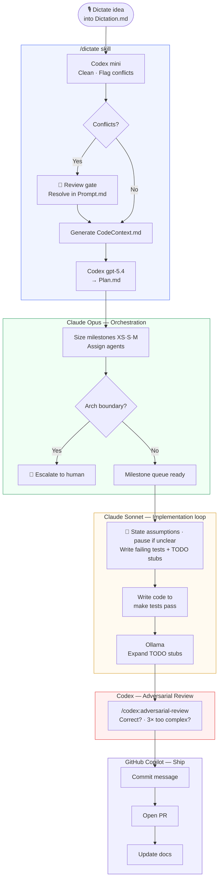
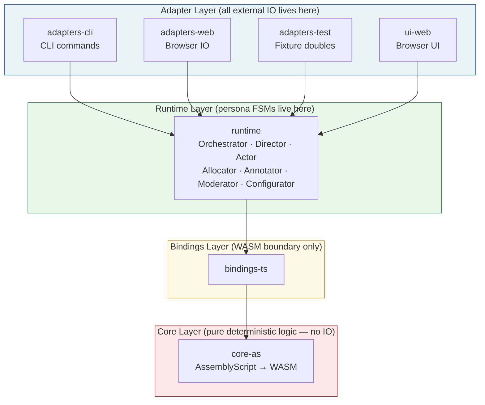
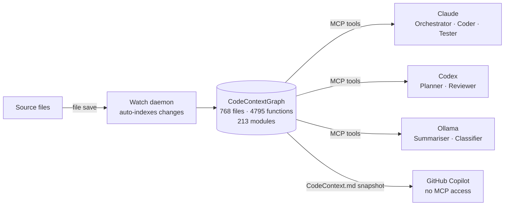

# Agent-Kernel: Multi-Agent Development Workflow

> A solo developer orchestrating four AI agents — each with a defined role, model, and scope — to take a spoken idea all the way to a merged pull request.

---

## The Cast

| Agent | Model | Effort | Role |
|---|---|---|---|
| **Codex** (OpenAI) | gpt-5.4 | high | Ideation · Plan authoring · Adversarial verification |
| **Claude Opus** | claude-opus-4-7 | high | Orchestration — split plans into sized milestones, assign agents |
| **Claude Sonnet** | claude-sonnet-4-6 | medium | Test-first authoring — writes failing tests + TODO permutation stubs *before* production code |
| **Claude Sonnet** | claude-sonnet-4-6 | high | Implementation — writes production code to make tests pass; all architecture refactors |
| **Codex** (cleanup) | gpt-5.4-mini | low | Dictation cleanup — strips filler, flags conflicting requirements |
| **Ollama** (local) | local model | — | Test permutation expansion · Summarisation · Classification |
| **GitHub Copilot** | — | — | Commit messages · PR authoring · Architecture & README updates |

---

## End-to-End Workflow



---

## Architecture: Ports & Adapters

All code must flow in one direction only. Violations are blocking — Claude refactors them immediately.



**Dependency rule:** adapters / ui-web → runtime → bindings-ts → core-as  
Inner layers must never import from outer layers.

---

## Shared Code Intelligence — CodeContextGraph

All three AI agents (Claude, Codex, Ollama) share a **live, auto-updating graph** of the codebase. No agent uses `grep` or `find` for structural questions.



| Query type | Tool used |
|---|---|
| Find a function | `find_code` |
| Trace imports / dependencies | `analyze_code_relationships` |
| Find risky / complex files | `find_most_complex_functions` |
| Find unused code | `find_dead_code` |
| Arbitrary structural query | `execute_cypher_query` |
| Repo-wide counts | `get_repository_stats` |

---

## Skill Commands

| Command | When to use |
|---|---|
| `/dictate` | **Step 1 — Planning.** Full pipeline: clean dictated text → flag conflicts → generate `Plan.md` |
| `/ollama-test-permutations` | **Step 2 — Tests.** Expand `## TODO: Test Permutations` stubs in test files using the local model |
| `/codex:adversarial-review` | **Step 3 — Verify.** Ask Codex to stress-test correctness and simplicity of a completed diff |
| `/codex:rescue` | **Ad hoc.** Hand a bounded task or debugging problem to Codex when Claude is stuck |
| `/codex:review` | **Ad hoc.** Standard Codex review of current git working tree |
| `/codex:setup` | **Ad hoc.** Check Codex auth & runtime status |
| `/graphify` | **Ad hoc.** Build a knowledge graph from any folder of files |

---

## Key Artifacts

| File | Purpose | Written by |
|---|---|---|
| `local-codex/Dictation.md` | Raw dictated text — input to `/dictate` | Developer |
| `local-codex/Prompt.md` | Cleaned, structured requirements | Codex mini (via `/dictate`) |
| `local-codex/Plan.md` | Milestone plan with agent assignments | Codex gpt-5.4 (via `/dictate`) |
| `local-codex/CodeContext.md` | Codebase snapshot for agent orientation | Claude (before each Codex handoff) |
| `local-codex/Documentation.md` | Live status, decisions, validation log | Claude (updated after each milestone) |
| `local-codex/Implement.md` | Execution runbook | Developer / Claude |
| `CLAUDE.md` | Architecture rules & enforcement checklist | Developer |
| `AGENTS.md` | Agent roster & collaboration contract | Developer |

---

## Milestone Sizing

Claude Opus is responsible for keeping milestones inside these bounds. Anything larger is split before work begins.

| Band | Max time | Max lines | Max files | Assigned to |
|---|---|---|---|---|
| **XS** | 30 min | 100 | 2 | Claude Sonnet |
| **S** | 1 hour | 250 | 5 | Claude Sonnet |
| **M** | 2 hours | 500 | 8 | Claude Sonnet |
| **> M** | — | — | — | Split first |

---

## Decision Rules

**Use `/dictate` when** you have a new idea, feature request, or change you want to plan — especially useful straight from a voice dictation.

**Use `/codex:rescue` when** Claude is stuck, needs a second opinion, or you want Codex to implement a bounded task from a spec.

**Use `/codex:adversarial-review` when** a design decision or completed diff needs stress-testing from a different model family. The review always asks two questions: (1) is this correct? and (2) is this 3× more complex than the simplest solution that meets the spec?

**Use `/ollama-test-permutations` when** a test file has `## TODO: Test Permutations` stubs ready to expand — saves expensive model tokens on mechanical generation.

**Claude states assumptions before every milestone** — explicit list of what it's assuming about scope, interfaces, and behaviour. If anything is unclear, Claude stops and asks rather than guessing.

**Claude writes failing tests first** — tests define success criteria before any production code is written. Code is written to make those tests pass, not the other way around.

**Claude refactors immediately (no permission needed) when** code violates the Ports & Adapters pattern, a persona FSM contract, or artifact schema rules.

**Claude escalates to you when** the correct layer for logic is ambiguous, the refactor crosses more than one package boundary, or architecture documentation would need to change.

---

## Persona State Machine Contract

Every persona in the runtime follows this interface without exception:

```
controller.mts      constructor(adapters, config)
                    advance(event, payload) → { nextState, effects }

state-machine.mts   view() → PersonaState
                    advance(event, payload) → { state, context, effects }
```

- Clock is **injected** — never read directly
- Context is **serializable** — no class instances or functions in state
- Effects are **data** — routing happens in `ports/effects.js`, not inside the persona

---

*Last updated: 2026-04-17 (Karpathy improvements: test-first, assumption gate, surgical changes, simplicity review) · agent-kernel · github.com/...*
