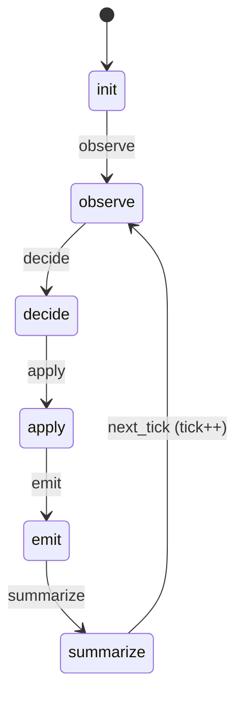
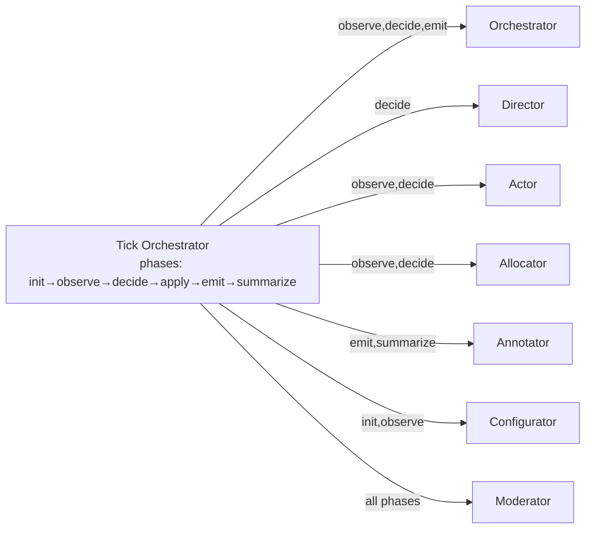
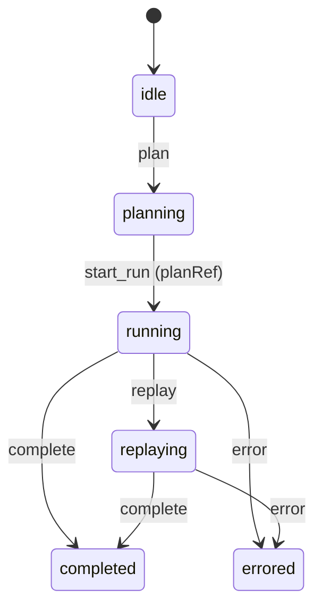
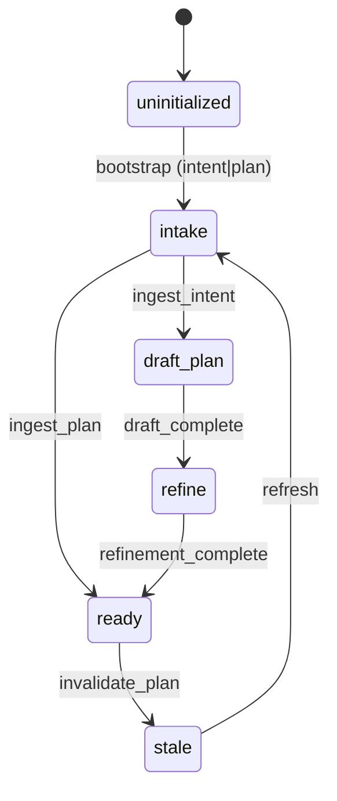
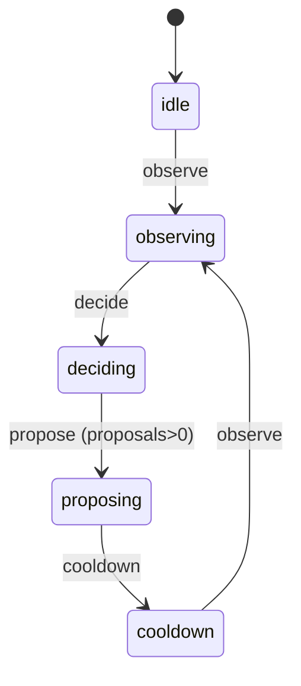
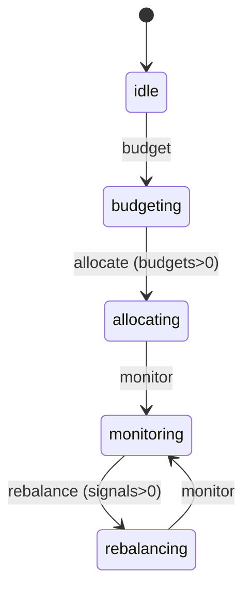
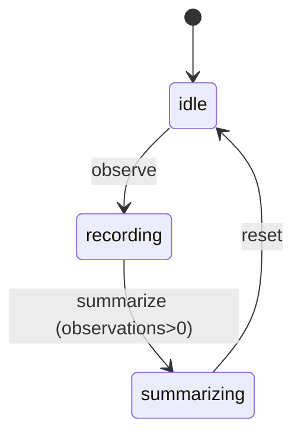
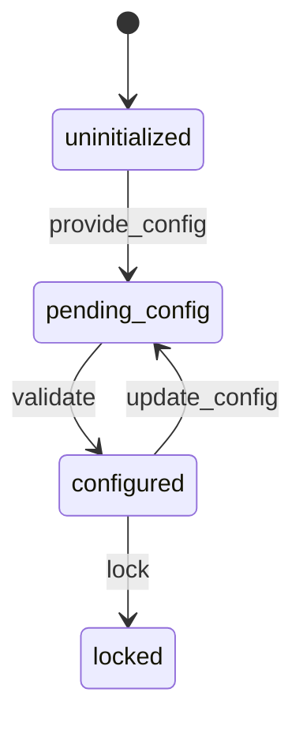
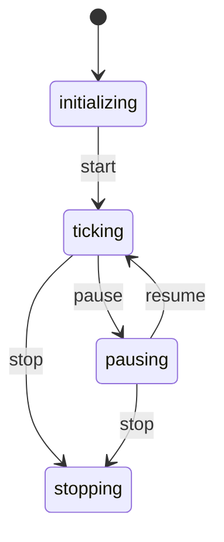

# Agent Kernel — Architecture Handout (Printable)

Focus on diagrams over text; minimal code references. Design anchors for avoiding drift.

## Ports & Adapters Shape
```mermaid
flowchart LR
  subgraph Interfaces["Interfaces"]
    UI["ui-web"]
    CLI["ak.mjs"]
  end
  subgraph Runtime["Runtime (TypeScript)"]
    Runner["tick orchestrator + runner"]
    subgraph Personas
      Orchestrator["Orchestrator"]
      Moderator["Moderator"]
      Director["Director"]
      Actor["Actor"]
      Allocator["Allocator"]
      Annotator["Annotator"]
      Configurator["Configurator"]
    end
  end
  subgraph Bindings["bindings-ts"]
    Bind["WASM bindings"]
  end
  subgraph Core["core-as (WASM)"]
    Core["Deterministic core"]
  end
  subgraph Adapters["Adapters (IO boundary)"]
    AWeb["adapters-web"]
    ACli["adapters-cli"]
    ATest["adapters-test"]
  end
  UI --> Runner
  CLI --> Runner
  Runner --> Core
  Runner --> AWeb
  Runner --> ACli
  Runner --> ATest
  Bind --> Core
  UI --> Bind
```

## Tick Super FSM


## Persona State Snapshots + Subscriptions
















## Non-negotiables (short)
- Core-as is deterministic, no IO/imports; Ports & Adapters are the IO boundary.
- Persona FSMs are pure, clock-injected, serializable; tick orchestrator drives phases.
- Effects are data-only with deterministic ids/requestIds and fulfillment hints; adapters fulfill `solver_request`, `need_external_fact` (fulfill/defer), `log`, `telemetry`, and `limit_violation` without core IO.
- Browser-first, replayable runs.

## Proposed / Not Yet Implemented
- External fact vault persistence beyond fixtures (cache + replay).
- Expanded inspect/HTML reporting.
- Per-persona README/state notes (only some personas currently have detailed docs).
- Rich solver integration beyond fixtures.

## Manual Smoke (fixtures, offline)
- `pnpm run build:wasm` then `pnpm run demo:cli` → artifacts in `artifacts/demo-bundle`.
- `pnpm run serve:ui` → open `http://localhost:8001/packages/ui-web/index.html` and run the Adapter Playground in fixture mode (IPFS/blockchain/LLM/solver); counter/effect log should show effect ids/requestIds/fulfillment.
- Expected artifacts: solve (`solver-request.json`, `solver-result.json`), run (`tick-frames.json`, `effects-log.json` with ids/requestIds/adapter hints), replay (`replay-summary.json`), inspect (`inspect-summary.json`), adapters (`ipfs.json`, `blockchain.json`, `llm.json`).
