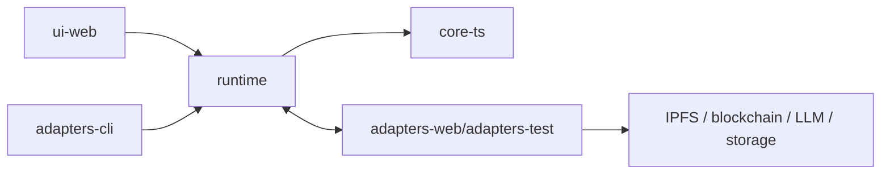

# Reference Handout

## Architecture


```mermaid
flowchart LR
  UI["ui-web"] --> Runtime["runtime"]
  CLI["adapters-cli"] --> Runtime
  Runtime --> Core["core-ts"]
  Runtime <--> Adapters["adapters-web/adapters-test"]
  Adapters --> External["IPFS / blockchain / LLM / storage"]
```

## Commands

```bash
pnpm run test
pnpm run test:coverage:core-ts
pnpm run benchmark:core-ts-affinity
pnpm run serve:ui
```

The core is TypeScript and synchronous. Simulation no longer requires a separate binary build.
